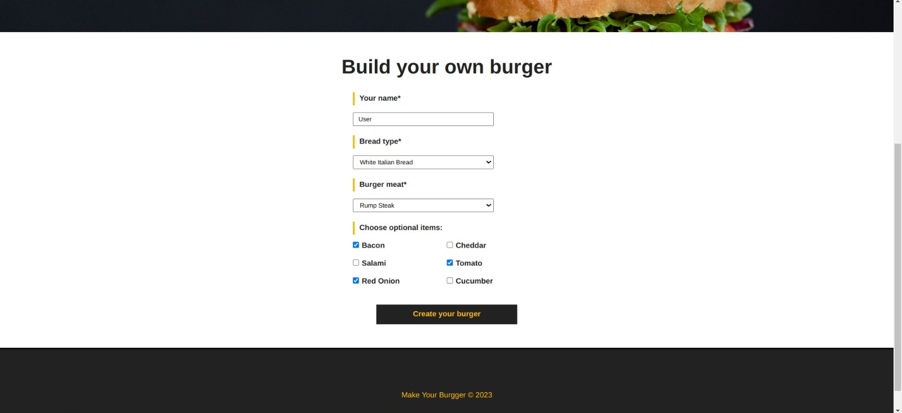
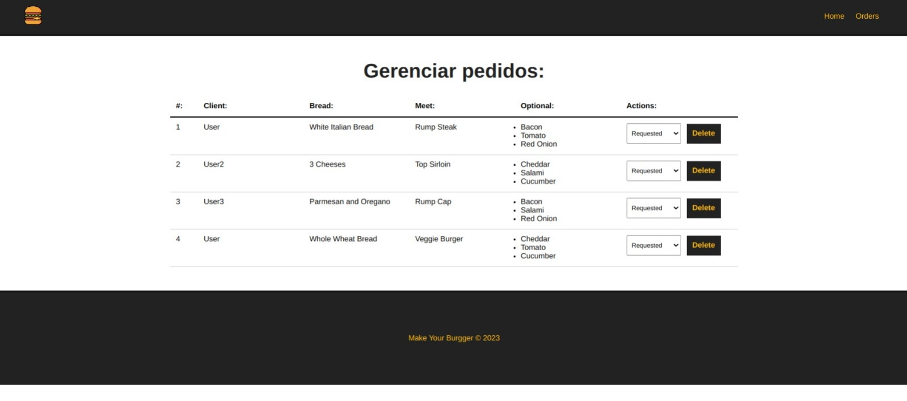

# Burger Builder

The **Burger Builder** is a web application that simplifies the customization of hamburger orders. With this project, customers can create their unique burgers by choosing the type of bread, the type of meat, and adding additional items such as cheddar, tomato, and bacon to suit their preferences. This README will provide an overview of the project, the features it offers, instructions for running and contributing to it, as well as the prerequisites to get started.




## Overview

The idea behind the **BurgerBuilder** is to provide a simple and quick experience for customizing hamburgers. Users can select the type of bread, the type of meat, and add or remove extra items to create the perfect burger. The goal is to create an intuitive and attractive interface that streamlines the process of creating hamburger orders.

## Features

The **BurgerBuilder Project** offers the following features:

1. **Bread Selection**: Users can choose from different types of breads, such as 3 cheeses, whole wheat, or mexican bread.

2. **Meat Selection**: Customers can select their desired type of meat, such as beef or vegetarian.

3. **Additional Items**: Users have the option to add extra items to their burger, such as cheddar cheese, tomato, bacon, and others, according to their personal taste.

4. **Real-time Orders Visualization**: Customer orders can be viewed in real time.

## Prerequisites

Make sure you have the following tools installed on your system before running the project:

- Node.js ^v20.4.0
- npm ^v9.8.0
- Vue.js ^v3.2.13

## How to Run the Project

To run the **BurgerBuilder Project** in your local environment, follow these steps:

1. **Clone the Repository**: Clone this repository to your local machine using the following command:

   ```bash
   git clone https://github.com/DouglasArS/burger-builder-with-vue.git
   ```


2. **Install Dependencies**: Navigate to the project directory and install the dependencies using npm or yarn:

   ```bash
   cd burger-builder-with-vue
   npm install
   ```


3. **Start the Backend Server**: Start the backend server with the following command:

   ```bash
   npm run backend
   ```

4. **Start the Application Server**: Start the application server with the following command:

   ```bash
   npm run serve (development mode)
   # or
   npm run build (production mode)
   ```

5. **Access the Application**: Open your browser and access the application at [http://localhost:8080](http://localhost:8080).

6. **Begin Building Your Burger**: Start building your custom burger!

## Contribution

If you wish to contribute to the **BurgerBuilder Project**, follow these guidelines:

1. Fork the repository to your GitHub account.
2. Create a branch with a descriptive name for your contribution.
3. Make your changes and add explanatory commits.
4. Submit a pull request to this repository, describing your changes and the reasons for them.

## License

This project is licensed under the MIT License. See the [LICENSE](LICENSE) file for details.

---

The **Burger Builder** is a fictional project created for demonstration purposes only. Feel free to use this README as a template for your own personal or fictional projects. Enjoy customizing your burgers! 🍔🍟